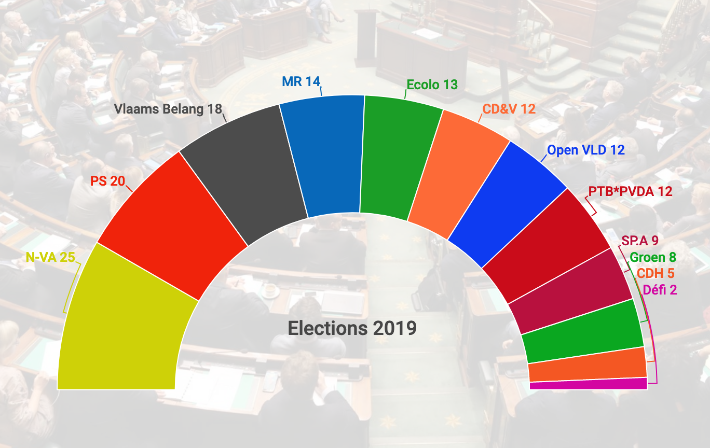

# be-gov-formation

**Program to form a governement after the 2019 Belgian federal elections 🇧🇪**

For the impatient: [a sample of possible governments](sample.txt).

Forming a governement after the recent Belgian elections is more challenging than ever. It is said that it might be impossible. Belgium holds the [world record](https://en.wikipedia.org/wiki/2010%E2%80%9311_Belgian_government_formation) as a country without an elected gouvernment since the 2010-11 crisis.

This program checks all possible combinations to form a government given constraints like
the number of seats, the parties known restrictions to form a government with certain other parties,
and the will to keep a balance in the FR/NL repartition.



*Photo credit: La Libre*

## Usage

Checkout or download this project, or simply the single file [solve.py](solve.py). You need to have Python 3 installed. There are no dependencies.

```
$ python solve.py 
Government with 6 parties and 78 seats: (PS (20), CD&V (12), PVDA+/PTB (12), Open Vld (12), sp.a (9), ECOLO (13))
Government with 6 parties and 75 seats: (PS (20), CD&V (12), Open Vld (12), MR (14), sp.a (9), Groen (8))
Government with 7 parties and 86 seats: (PS (20), CD&V (12), PVDA+/PTB (12), Open Vld (12), sp.a (9), ECOLO (13), Groen (8))
Government with 7 parties and 80 seats: (PS (20), CD&V (12), Open Vld (12), MR (14), sp.a (9), Groen (8), cdH (5))
Government with 7 parties and 77 seats: (PS (20), CD&V (12), Open Vld (12), MR (14), sp.a (9), Groen (8), DéFI (2))
Government with 7 parties and 79 seats: (PS (20), CD&V (12), Open Vld (12), sp.a (9), ECOLO (13), Groen (8), cdH (5))
Government with 7 parties and 76 seats: (PS (20), CD&V (12), Open Vld (12), sp.a (9), ECOLO (13), Groen (8), DéFI (2))
Government with 8 parties and 88 seats: (PS (20), CD&V (12), PVDA+/PTB (12), Open Vld (12), sp.a (9), ECOLO (13), Groen (8), DéFI (2))
Government with 8 parties and 82 seats: (PS (20), CD&V (12), Open Vld (12), MR (14), sp.a (9), Groen (8), cdH (5), DéFI (2))
Government with 8 parties and 81 seats: (PS (20), CD&V (12), Open Vld (12), sp.a (9), ECOLO (13), Groen (8), cdH (5), DéFI (2))
Government with 8 parties and 75 seats: (CD&V (12), Open Vld (12), MR (14), sp.a (9), ECOLO (13), Groen (8), cdH (5), DéFI (2))
```

## Applicability

This program has been designed for Belgium. However, if it works in Belgium, it is bound to succeed anywhere else on the planet.

It can be used by curious citizens, politicians, person in charge of the government formation (*formateur*, *informateur*, *démineur* or any other role we will make up this time), or monarchs in charge of designating such person.

## Known limitations

* The exclusion list is incomplete
* A valid government composition does not guarantee its success.

## License

This project is free software, because the Belgian people badly need it. [Licensed under the GNU GENERAL PUBLIC LICENSE, version 3](LICENSE.txt). THERE IS NO WARRANTY FOR THIS PROGRAM, TO THE EXTENT PERMITTED BY
APPLICABLE LAW. Use at your own risk.
